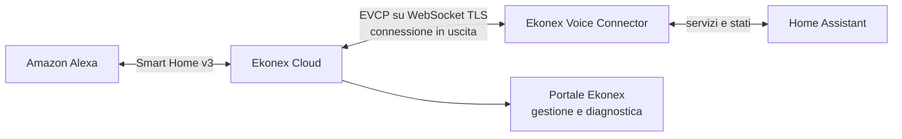

<div align="center">
  

# Ekonex Voice

**Il ponte sicuro tra Home Assistant, Ekonex Cloud e Amazon Alexa.**

[](https://github.com/edmondoalex/e-voice/releases)
[](https://hacs.xyz/)
[](https://www.home-assistant.io/)
[](LICENSE)

> **Canale corrente: beta.** La versione installabile più recente è indicata dal badge HACS release e viene distribuita come prerelease GitHub.

[Installazione](#installazione-con-hacs) · [Come funziona](#come-funziona) · [Documentazione](#documentazione) · [Sviluppo](#sviluppo)
</div>

---

## Un'unica voce per la casa connessa

Ekonex Voice collega le entità selezionate in Home Assistant ad Amazon Alexa attraverso un'infrastruttura cloud multi-tenant. Il Connector mantiene una connessione WebSocket **in uscita** verso Ekonex Cloud: non richiede porte aperte verso la rete domestica e lascia Home Assistant al centro dell'automazione e dello stato reale dei dispositivi.

Il progetto comprende:

- un'integrazione custom nativa per Home Assistant, installabile e aggiornabile tramite HACS;
- pairing sicuro tra impianto e cloud, senza configurazione YAML;
- esposizione opt-in delle sole entità scelte dall'installatore;
- sincronizzazione di inventario e stato in tempo reale;
- comandi tipizzati e allowlistati dal cloud verso Home Assistant;
- Alexa Smart Home v3 con Discovery, controllo, state reporting ed eventi proattivi;
- portale multi-tenant con installazioni, attività e diagnostica operativa;
- controllo di compatibilità tra versione Cloud, Connector e protocollo EVCP.

## Come funziona



1. Il Connector viene associato a un'installazione Ekonex tramite pairing.
2. L'installatore sceglie quali entità rendere disponibili al cloud.
3. Inventario e variazioni di stato vengono sincronizzati sulla sessione EVCP.
4. Alexa risolve una direttiva sull'endpoint pubblicato da Ekonex Voice.
5. Il cloud traduce la direttiva in un'operazione consentita e la inoltra al Connector.
6. Home Assistant esegue il servizio appropriato e restituisce l'esito lungo la stessa correlazione.

### Principi progettuali

| Principio | Cosa significa |
|---|---|
| **Home Assistant resta autorevole** | Stato, automazioni ed esecuzione dei servizi rimangono in Home Assistant. |
| **Nessuna porta in ingresso** | Il Connector apre una connessione WebSocket TLS verso il cloud. |
| **Esposizione esplicita** | Le entità non vengono pubblicate automaticamente: la selezione è opt-in. |
| **Comandi controllati** | Il protocollo usa operazioni tipizzate, non chiamate arbitrarie a servizi HA. |
| **Isolamento multi-tenant** | Installazioni, sessioni e comandi sono sempre circoscritti al tenant. |
| **Diagnostica correlata** | Direttiva, dispatch EVCP ed esecuzione HA possono essere seguiti senza esporre credenziali. |

## Installazione con HACS

> Ekonex Voice è attualmente distribuito nel canale **prerelease/beta**. In HACS abilita la visualizzazione delle versioni beta e seleziona una release con tag, non il branch `main`.

1. Apri **HACS → Integrazioni** in Home Assistant.
2. Dal menu scegli **Repository personalizzati**.
3. Inserisci `https://github.com/edmondoalex/e-voice`.
4. Seleziona la categoria **Integrazione** e aggiungi il repository.
5. Installa la prerelease più recente di **Ekonex Voice**.
6. Riavvia Home Assistant quando richiesto.
7. Vai in **Impostazioni → Dispositivi e servizi → Aggiungi integrazione**.
8. Cerca **Ekonex Voice** e completa il pairing mostrato a schermo.

Non sono richiesti YAML né porte esposte su Internet.

### Aggiornamento o reinstallazione beta

In **HACS → Ekonex Voice**, apri il menu, scegli **Scarica di nuovo** e, se necessario, **Serve una versione diversa?**. Seleziona esplicitamente il tag della prerelease desiderata. Al termine verifica la versione in Home Assistant e riavvia l'integrazione.

### Esposizione delle entità

L'esposizione è volontaria. Le entità vengono selezionate dalle opzioni dell'integrazione Ekonex Voice e/o tramite l'etichetta Home Assistant dedicata. Il cloud riceve esclusivamente l'inventario autorizzato per quella installazione.

Per flusso di pairing, criteri di esposizione e verifica HAOS consulta la [guida del Connector Home Assistant](docs/home-assistant.md) e la [sicurezza del pairing](docs/pairing.md).

## Funzionalità

### Home Assistant Connector

- config flow e pairing guidato;
- ciclo di vita gestito con unload, reconnect e heartbeat;
- sincronizzazione completa e incrementale dell'inventario;
- coalescing degli aggiornamenti di stato;
- diagnostica con redazione dei dati sensibili;
- rilevamento della compatibilità Cloud ↔ Connector.

### Alexa Smart Home

- OAuth account linking;
- Discovery degli endpoint autorizzati;
- mapping per luci, switch, cover, climate, scene e sensori supportati;
- response properties e aggiornamenti proattivi;
- tracciamento diagnostico della catena direttiva → endpoint → operazione → comando.

La matrice delle capability e la procedura AWS sono descritte nella [guida Alexa Smart Home](docs/ALEXA_SMART_HOME.md). Il deployment dell'adapter Lambda è documentato separatamente in [aws_lambda/alexa_smart_home/README.md](aws_lambda/alexa_smart_home/README.md).

### Cloud e portale

- API Python con PostgreSQL e Redis;
- gestione multi-tenant di clienti e installazioni;
- sessioni EVCP con ownership per installazione;
- attività e audit correlati;
- indicatori di versione, protocollo e stato del Connector;
- amministrazione dei nomi vocali e delle entità pubblicate.

## Sicurezza e privacy

Ekonex Voice adotta un modello a privilegi minimi:

- il Connector avvia la connessione; il cloud non entra nella rete Home Assistant;
- token, segreti OAuth e credenziali non devono comparire nei log diagnostici;
- le operazioni eseguibili sono definite da una allowlist;
- ogni richiesta è vincolata a tenant e installazione;
- una sessione assente, obsoleta o incompatibile fallisce in modo esplicito e chiuso;
- Home Assistant continua a gestire localmente automazioni e dispositivi anche se il cloud non è raggiungibile.

Le decisioni architetturali e i confini di sicurezza sono raccolti negli [Architecture Decision Records](docs/adr/README.md).

## Documentazione

| Area | Documento |
|---|---|
| Panoramica tecnica | [Architettura](docs/architecture.md) |
| Home Assistant | [Connector e procedure HAOS](docs/home-assistant.md) |
| Standard di integrazione | [Ekonex Home Assistant Integration Standard](docs/EKONEX_HA_STANDARD.md) |
| Pairing | [Sicurezza e ciclo delle credenziali](docs/pairing.md) |
| Protocollo | [EVCP v1](docs/EVCP_V1.md) |
| Alexa | [Alexa Smart Home v3](docs/ALEXA_SMART_HOME.md) |
| Portale | [Console di amministrazione](docs/ADMIN_CONSOLE.md) |
| Specifica | [Baseline funzionale V1](docs/SPEC_V1.md) |
| Decisioni | [ADR](docs/adr/README.md) |
| Evoluzione | [Changelog](CHANGELOG.md) |

## Sviluppo

### Requisiti

- Python 3.13;
- Docker con Docker Compose;
- PostgreSQL e Redis, inclusi nello stack Compose.

### Avvio locale con Docker

```bash
cp .env.example .env
docker compose up --build
```

L'endpoint di liveness è disponibile su:

```text
GET /health
```

### Ambiente Python locale

```bash
python -m venv .venv
python -m pip install -e ".[dev]"
uvicorn apps.cloud_api.app.main:app --reload
```

### Quality gate

```bash
ruff format --check .
ruff check .
mypy apps custom_components
pytest
docker compose config --quiet
```

La CI include inoltre la validazione HACS e Home Assistant Hassfest. Le release HACS vengono pubblicate come `ekonex_voice.zip` con struttura piatta e versione del manifest coerente con il tag GitHub.

---

<div align="center">
  <strong>Ekonex Voice</strong><br>
  Home Assistant al centro. Alexa come interfaccia. Ekonex come collegamento sicuro.
</div>
